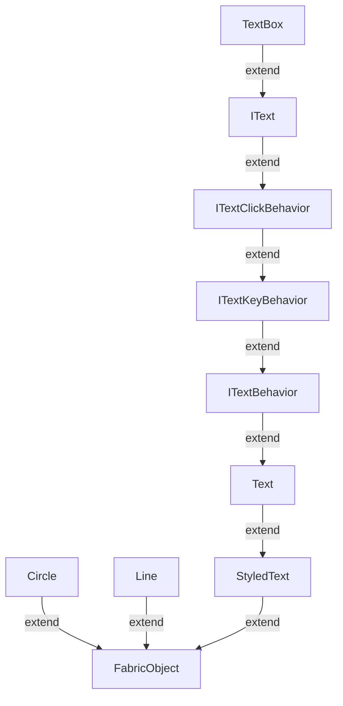

# nuxt + fabricjsで縦書きテキストボックスを作りたい

まず、Textboxに関するクラスの関係。参考までに記したLineやCircleなどのオブジェクトに対して明らかに複雑である。

この中で`Text`, `IText`, `Textbox`はcanvasに配置可能である。機能的な違いは以下

- `Text`: 編集はできない
- `IText`: Textに対して編集ができるようになる。（＋他）
- `TextBox`： ITextに対してwrapとかができるようになる（＋他）

canvas配置後に再編集しないのであれば`Text`、再編集したいのであれば`TextBox`を使っていけば良さそう。

# `StyledText`クラス

オブジェクトへのstyleの設定、削除、取得などを役割としているクラス。
このクラスでは文字列を「横書き」することはわからない（描画をしていない）。

# `Text`クラス

canvasに配置可能であることから分かる通り、このクラスの以降の派生クラスは「横書き」前提で作られている。

縦書きテキストボックスを作るのであればこのクラス以降の派生クラスを縦書き用にカスタマイズして`VerticalTextbox`を作らなければならない

## 用語：Grapheme

この辺りからGraphemeというワードが出てくる。

Graphemeとは日本語で言う書記素である。

> 書記素（しょきそ、英: grapheme）とは、書記言語において意味上の区別を可能にする最小の図形単位をいう
> 
> Wikipediaより：https://ja.wikipedia.org/wiki/書記素

## 用語：カーニング

`kernedWidth`などの変数として出てくる。

> カーニング（英語: kerning）とは、主に欧文の組版において、プロポーショナルフォントの文字同士の間隔（アキ）を調整する技法のこと。カーニングを行わない場合は、文字の間に不自然な空白を招いてしまう。適切にカーニングが施されたフォントでは、字面間の空白の面積がほぼ均等になる。
> 
> Wikioediaより：https://ja.wikipedia.org/wiki/カーニング
